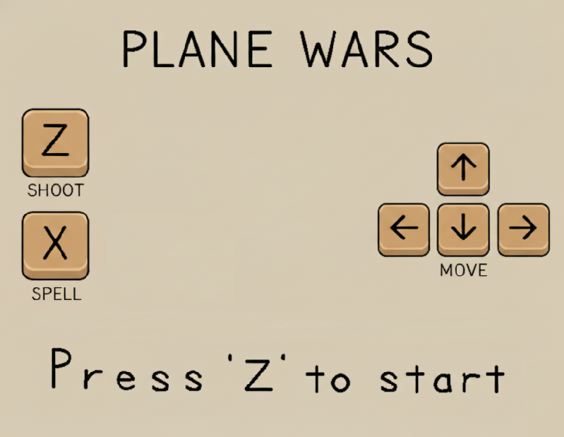
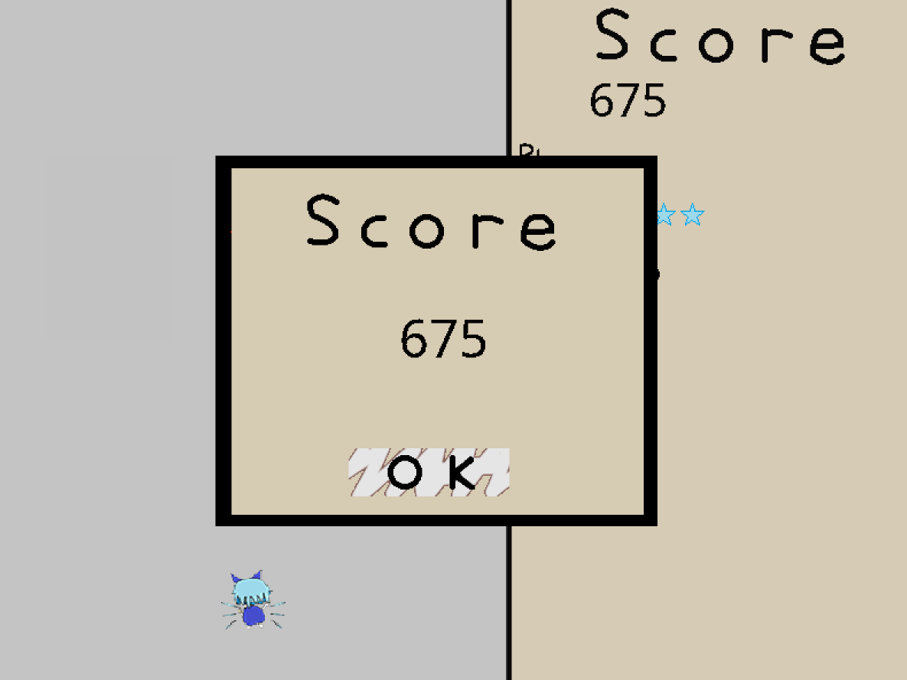

#  ✈️WebServer-PlaneWar

> 一个基于 C++17 重构的高性能 Web 服务器，并在浏览器中完美运行经典“飞机大战”游戏！

## 🌟 项目简介 (Introduction)

本项目是一个基于 **C++17** 从零手写的高性能 HTTP Web 服务器。

在实现基础的静态资源请求处理、高并发连接管理之上，引入了 **Cheerpj** 运行环境。 

服务器基于该组件将原生基于 Java 开发的经典“飞机大战”（Plane War）小游戏转化为 Web 应用，输入服务器地址后即可在浏览器中畅玩。

## 🚀 技术亮点 (Highlights)

* 封装了**文件描述符（channel类）**，**Epoll 事件**，**HTTP 连接**等核心组件，使用 RAII 设计模式管理资源生命周期。
* 利用 **I/O 多路复用技术（Epoll）**和**线程池**实现高效的事件驱动模型。
* 基于**有限状态机 (FSM)** 实现 HTTP 请求解析器。
* 实现了支持多线程并发写入的**异步日志系统**。基于阻塞队列将前端写日志的动作与后端磁盘 I/O 分离。
* 基于 **string_view** 和**滑动窗口**封装标准库容器，实现自动增长的缓冲区。
* 支持 **206 Partial Content** 响应，满足断点续传需求。
* 引入 **Cheerpj** 将 Java 游戏转化为 Web 应用，完美运行经典“飞机大战”游戏。

## 🛠️ 构建与运行 (Build & Run)
1. 克隆仓库并进入项目目录：

   ```bash
   git clone
   cd WebServer-PlaneWar  
   ```
   
2. 使用 CMake 构建项目：

   ```bash
    mkdir build
    cd build
    cmake ..
    make
    ```
3. 运行服务器：
    ```bash
    ./WebServer
    ```
4. 在浏览器中访问 `http://localhost:12345` 运行“飞机大战”游戏。 

## 🎮 游戏截图 (Screenshots)






